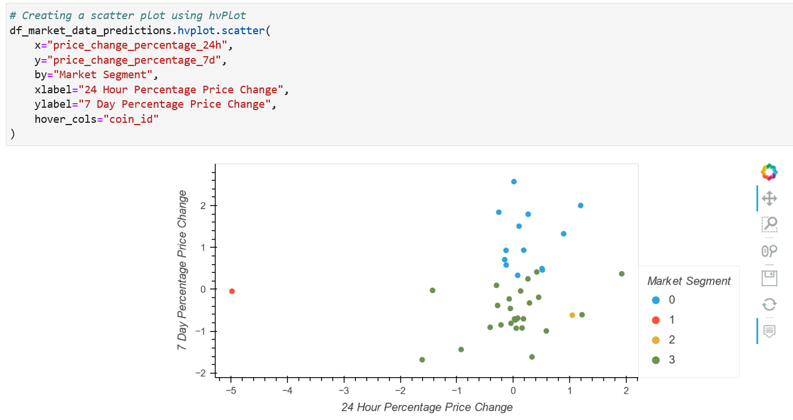

# Crypto_investments

This **Jupyter notebook** uses unsupervised learning to cluster cryptocurrencies by their performance in different time periods, and it creates scatter plots grouped by resulting clusters.

---

## Technologies

For this project we use the following tools:


* [JupyterLab](https://github.com/jupyterlab/jupyterlab) - an extensible environment for interactive and reproducible computing, based on the Jupyter Notebook and Architecture

* [pandas](https://github.com/pandas-dev/pandas) - is a Python package that provides fast, flexible, and expressive data structures designed to make working with "relational" or "labeled" data both easy and intuitive 

* [hvplot](https://hvplot.holoviz.org/) - hvPlot provides an alternative for the static plotting API provided by Pandas and other libraries

* [Scikit-learn](https://scikit-learn.org/stable/) - is widely used for classification, predictive analytics, and very many other machine learning tasks

* [K-Means](https://realpython.com/k-means-clustering-python/) - is an unsupervised machine learning technique used to identify clusters of data objects in a dataset

* [StandardScaler](https://scikit-learn.org/stable/modules/generated/sklearn.preprocessing.StandardScaler.html) - StandardScaler standardizes a feature by subtracting the mean and then scaling to unit variance

* [Principal Component Analysis (PCA)](https://www.datacamp.com/community/tutorials/principal-component-analysis-in-python) - is a linear dimensionality reduction technique that can be utilized for extracting information from a high-dimensional space by projecting it into a lower-dimensional sub-space

---

## Examples

After importing all required libraries, we create a DataFrame and plot the initial data:
 


Using **elbow method** and **K-Means alghorithm**, we create a DataFrame and plot the Elbow Curve in order to determine the best value of **k**:


We cluster cryptocurencies with K-Means using the original data



Then we find the best value for **k** using the PCA data:


And we cluster cryptocurencies with K-Means using the PCA data


Finally, we visualize and compare our results:


## Instalation Guide

Before opening the Jupyter notebook, you need to install:

```python
pip install -U scikit-learn
```

```python
conda install -c pyviz hvplot
```

---

## Contributors

Author: Magdalena Svimberska
email: magdalena.svimberska@gmail.com

---

## License

GNU General Public License